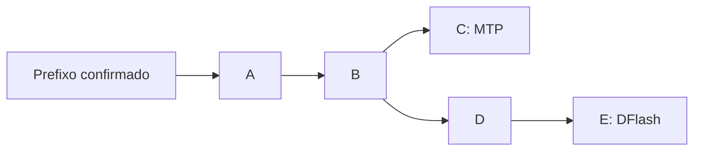

# Plano: MTP e DFlash2 concorrentes com reaproveitamento de sufixo

Data: 2026-09-29. Estado: Etapas 0/1 medidas; piloto ativo da Etapa 2 implementado
e testado, com resultado negativo de desempenho (§2.8). Recomendação atual: MTP n4 isolado.

Base examinada na elaboração: branch `fix/dflash-xbox-pipeline`, commit `12231b55e`,
com as correções locais de split/prefetch pendentes naquele levantamento, depois
registradas em `47af27df0` e publicadas em `6281c6b56`. A Etapa 0 foi executada em
2026-09-29 com a referência renovada na seção 2.1. Este documento consolida a
discussão e propõe a primeira validação; não aprova automaticamente a implementação
das etapas seguintes nem muda a produção.

## 1. Recomendação para a primeira implementação

**Resultado atual:** o piloto ativo foi executado. A melhor variante híbrida
ficou aproximadamente 4–7% abaixo do MTP n4 na confirmação com cinco repetições;
MTP curto + DFlash ficou 13–19% abaixo. O histórico do desenho inicial segue
abaixo; detalhes e limites da decisão estão na seção 2.8.

**Começar com MTP como referência e DFlash2 em observação paralela, ambos partindo
do mesmo prefixo confirmado.** O DFlash gera um bloco maior, mas seus tokens ainda
não são usados na resposta. Medimos se ele fica pronto no prazo, se o prefixo
coincide com a saída real e quanto do sufixo poderia ser aproveitado.

Essa etapa responde à incerteza principal: **há trabalho útil já pronto na Radeon
quando a próxima rodada precisaria gerar outro draft MTP?** Ela também mede o
custo das features, do seletor e da sincronização, mesmo quando nada é aproveitado.

Se os resultados justificarem, a segunda implementação passa a entregar o sufixo
pronto ao verificador normal do alvo. A verificação em árvore fica para uma etapa
posterior, pois exige mudanças maiores e ainda não sabemos se os dois drafts têm
diversidade útil suficiente.

Decisões propostas para o primeiro protótipo:

| Item | Proposta |
| --- | --- |
| Draft principal | MTP na 4070, sempre responsável pela trajetória no modo observação |
| Auxiliar | DFlash2 Q4_K_M na Radeon, com seletor junto ao head do alvo |
| Ponto de partida | Mesmo histórico confirmado e mesmo token âncora |
| Comprimentos | MTP com limites 2, 3 e 4; DFlash com até 7 propostas |
| Concorrência | Uma requisição, um slot, um trabalho auxiliar em voo |
| Amostragem inicial | Gulosa, `temperature=0` |
| Espera adicional pelo auxiliar | Zero na escolha do próximo draft |
| Prefetch local já existente | Desligado, para isolar o mecanismo novo |
| Primeiro resultado esperado | Relatório de viabilidade, sem alegar ganho híbrido antes de medi-lo |

## 2. O que já foi medido

Os [dados de referência históricos](benchmarks/mtp-dflash2-hybrid-baselines-20260929.json)
incluem resultados, comandos executados, prompts completos, configurações e hashes
dos binários disponíveis. Os logs integrais desses ensaios históricos continuam nos
diretórios temporários indicados nesse arquivo. A referência renovada da Etapa 0
está preservada no repositório, com logs e telemetria, em
[benchmarks/mtp-dflash2-etapa0-20260929-122824](benchmarks/mtp-dflash2-etapa0-20260929-122824/README.md).
Ela prevalece sobre os resultados históricos para a decisão de implementação.

Ambiente: GOKAYA, Ryzen Z1 Extreme com Radeon integrada, RTX 4070 em eGPU;
alvo `Qwen3.8-27B-GSQ-RCO-IQ3_XXS-mtp.gguf`; draft
`Qwen3.8-27B-DFlash2-Q4_K_M.gguf`; contexto 16384; batch/ubatch 64; um slot;
KV `q4_0`; 192 tokens gerados. O prompt longo tinha 13850 tokens de entrada.

| Configuração medida | Repetição, tok/s | Código, tok/s | Longo, tok/s |
| --- | ---: | ---: | ---: |
| MTP, limite 4 e p_min 0,70, 2026-09-28 | 87,85 | 60,94 | 57,98 |
| DFlash local, limite 6, CPU econômica, APU 20 W, Radeon 2700 MHz | 71,43 | 48,26 | 49,71 |
| DFlash local, limite 6, CPU performance, APU 25 W, Radeon 2700 MHz | 72,99 | 47,91 | 51,83 |
| DFlash local, limite 6, CPU performance, APU 30 W, Radeon 2700 MHz | 72,09 | 48,30 | 51,64 |

- O MTP da tabela teve uma execução por prompt; os últimos DFlash usam mediana de
  três execuções curtas e duas longas. Não constituem um A/B contemporâneo.
- MTP e DFlash produziram os mesmos hashes nos prompts curtos da comparação
  original, mas hashes diferentes no longo. As otimizações posteriores do DFlash
  preservaram sua própria saída. Não há prova histórica de equivalência exata
  entre todas as trajetórias MTP e DFlash no prompt longo.
- Aumentar somente o TDP de 20 para 25/30 W manteve a Radeon perto de 800 MHz e
  praticamente não alterou a velocidade. Solicitar SCLK de 2700 MHz trouxe ganho
  de aproximadamente 7–9% já em 20 W nos testes correspondentes.
- O clock efetivo da CPU, medido por APERF/MPERF, subiu de aproximadamente 1,44 GHz
  em economia para 2,82–3,17 GHz em performance, sem ganho consistente de geração.
- A colocação do seletor junto ao head CUDA reduziu sua mediana de 5,691 para
  2,076 ms no A/B de colocação. A etapa de draft local ainda levou dezenas de ms
  por bloco; essa etapa inclui preparação, execução e obtenção dos hidden rows.
- O prefetch local corrigido teve 16 tentativas e zero reaproveitamentos no
  conjunto da revisão. Ele prevê outro ponto/âncora; esse resultado **não mede** a
  proposta de dois drafts partindo do mesmo prefixo descrita aqui.
- Os ensaios acima usaram DFlash com limite 6. O bloco com 7 propostas foi medido
  na Etapa 0 (seção 2.1): mudar o tamanho do bloco de difusão muda as previsões e
  o desempenho de forma não uniforme.

O fato de DFlash sozinho ser mais lento que MTP não decide o resultado híbrido.
O ganho depende do trabalho útil sobreposto e do custo adicional imposto ao alvo.

### 2.1 Etapa 0 executada (2026-09-29, referência renovada)

Mesmo binário e ambiente do futuro protótipo (`main` em `6281c6b56`; hashes dos
binários idênticos aos registrados). Contexto 16384, batch/ubatch 64, um slot, KV
`q4_0`, temperature 0, seed 42, 192 tokens; 3 execuções por prompt curto e 2 por
longo, mediana. MTP na 4070 com p_min 0,70; DFlash2 Q4_K_M na Radeon com split
local, prefetch desligado, APU 20 W, SCLK 2700 MHz e CPU na política original.

| Modo | Repetição, tok/s | Código, tok/s | Longo, tok/s | Prefill longo, tok/s |
| --- | ---: | ---: | ---: | ---: |
| MTP n=2 | 67,06 | 57,45 | 51,10 | 676 |
| MTP n=3 | 74,95 | 57,65 | 54,17 | 670 |
| MTP n=4 | 84,50 | 59,08 | 57,41 | 666 |
| DFlash n=6 | 70,05 | 47,40 | 49,69 | 649 |
| DFlash n=7 | 73,85 | 44,53 | 47,98 | 646 |

- MTP n=4 segue como a melhor referência isolada nos três cenários e é a meta a
  superar na Etapa 2.
- DFlash n=7 supera n=6 apenas em repetição (+5,4%); perde em código (−6,1%) e no
  longo (−3,4%). O bloco de difusão maior não é ganho uniforme e o n=7 entra como
  caso próprio na comparação.
- Hashes de saída por modo (prefixos; valores completos na evidência): na
  repetição, MTP n=2 = n=3 (`55b20c7c`) e MTP n=4 = DFlash n=6 = n=7
  (`031bf5c6`); no código há três trajetórias (`f582cdd9`, `bd1a517e`,
  `19f387f9`); no longo, todos os MTP coincidem (`1e9b0179`) e o DFlash diverge
  (`8508b88d`). A trajetória gulosa do MTP muda com o `n_max` e a coincidência
  MTP×DFlash não pode ser presumida; são dados diretos para a validação da
  seção 10.
- DFlash n=6 de hoje (70,05/47,40/49,69) confere com o registro de mesmo binário
  (71,43/48,26/49,72) dentro da dispersão; MTP n=4 ficou 3–4% abaixo do registro
  de 2026-09-28 de execução única, com o longo praticamente igual.

Comandos exatos, prompts, respostas, telemetria de potência/clocks e hashes de
modelo/binário estão em
[benchmarks/mtp-dflash2-etapa0-20260929-122824](benchmarks/mtp-dflash2-etapa0-20260929-122824/README.md).

### 2.2 Quantização do auxiliar DFlash2: Q2_K contra Q4_K_M (2026-09-29)

Mesmo binário e ambiente da seção 2.1; só o arquivo do draft mudou
(`Qwen3.8-27B-DFlash2-Q2_K.gguf`, sha256 `e3eb7705` como prefixo; valor completo
na evidência). Mediana de 3 execuções curtas e 2 longas por modo.

| Auxiliar DFlash2 | Repetição, tok/s | Código, tok/s | Longo, tok/s | Prefill longo, tok/s |
| --- | ---: | ---: | ---: | ---: |
| Q4_K_M n=6 | 70,05 | 47,40 | 49,69 | 649 |
| Q2_K n=6 | 67,78 | 45,97 | 40,81 | 653 |
| Q4_K_M n=7 | 73,85 | 44,53 | 47,98 | 646 |
| Q2_K n=7 | 71,33 | 44,52 | 38,23 | 650 |

- Q2_K ficou 3–4% mais lento nos prompts curtos e 18–20% mais lento no longo
  nessa execução isolada. A economia de memória (~0,7 GB contra ~1,1 GB) não
  trouxe ganho nesse teste; a referência inicial do auxiliar segue Q4_K_M.
- As saídas finais do Q2_K coincidiram com as do Q4_K_M nos três cenários
  (`031bf5c6`, `19f387f9`, `8508b88d`). A revisão encontrou os contadores de
  aceitação nos logs: no longo, n=7 caiu de 61,11% em Q4 para 44,72% em Q2;
  n=6 caiu de 67,40% para 51,80%. Isso apoia manter Q4 como referência.
  O custo por bloco e a utilidade do Q2 como auxiliar concorrente ainda não
  foram isolados; desempenho isolado não encerra essa questão.
- Comandos, telemetria e hashes em
  [benchmarks/mtp-dflash2-etapa0-q2-20260929](benchmarks/mtp-dflash2-etapa0-q2-20260929/README.md).

### 2.3 Custo de manter o auxiliar sincronizado (2026-09-29)

Caso 2 da matriz da seção 9: MTP n=4 como primário e auxiliar DFlash2 Q4_K_M
carregado na Radeon, recebendo `begin/process/accept` no mesmo prefixo, **sem
gerar blocos** (o `draft()` do auxiliar não é chamado). Mesmo ambiente e prompts
da Etapa 0; mediana de 3 execuções curtas e 2 longas.

| Configuração | Repetição, tok/s | Código, tok/s | Longo, tok/s | Prefill longo, tok/s |
| --- | ---: | ---: | ---: | ---: |
| MTP n=4 isolado (Etapa 0) | 84,50 | 59,08 | 57,41 | 666 |
| MTP n=4 + auxiliar sincronizado | 81,65 | 56,61 | 54,76 | 631 |
| Diferença | −3,4% | −4,2% | −4,6% | −5,2% |

- Hashes idênticos ao MTP isolado (`031bf5c6`, `19f387f9`, `1e9b0179`): o
  auxiliar não alterou a resposta.
- Este é o piso de custo do modo de observação (injeção de features na KV da
  Radeon por ciclo); o benefício da Etapa 2 precisa superá-lo.
- Evidência em
  [benchmarks/mtp-dflash2-shadow-sync-cost-20260929](benchmarks/mtp-dflash2-shadow-sync-cost-20260929/README.md).

### 2.4 Observação paralela assíncrona (2026-09-29)

> **Resultados históricos com limitações identificadas:** a revisão posterior
> encontrou bônus obtido da entrada da verificação, descarte de propostas antes
> do commit, KV auxiliar com linhas rejeitadas e prontidão avaliada após executar
> o MTP. Assim, 99% de prontidão e 3,6% de coincidência não são medidas válidas
> para decidir a Etapa 2. Os timers de etapas também excluíam as sincronizações
> dos getters. Os valores abaixo ficam como histórico da implementação anterior;
> a remedição corrigida é registrada na seção 2.5.

O bloco auxiliar passou a rodar em um worker a partir do mesmo prefixo/âncora do
MTP, com um trabalho em voo, join apenas quando o future já está pronto e
descarte contado quando o ciclo avança. A sequência confirmada (incluindo bônus,
`c = n_accepted + 1`) é cruzada com a proposta pela âncora do draft verificado.
Mesma bateria da Etapa 0 (3 curtas + 3 de código + 2 longas).

| Configuração | Repetição, tok/s | Código, tok/s | Longo, tok/s |
| --- | ---: | ---: | ---: |
| MTP n=4 isolado (Etapa 0) | 84,50 | 59,08 | 57,41 |
| + auxiliar sincronizado, sem blocos (2.3) | 81,65 | 56,61 | 54,76 |
| + observação assíncrona | 57,3–58,4 | 43,3–44,5 | 38,7–42,4 |

- Prontidão na decisão: 407 de 411 blocos prontos (~99%); atraso não é o
  problema.
- Coincidência completa do prefixo, **incluindo o bônus**: 7 de 193 observações
  (~3,6%), 33 tokens de sufixo utilizável em ~1600 gerados. Na maioria dos
  casos o auxiliar acerta os tokens aceitos do MTP e diverge no bônus (distância
  típica de 3 tokens até a coincidência completa).
- Custo do MVP: ~30% de queda na geração; o caso 3 da matriz da seção 9 cabe no
  prazo, mas hoje custa mais do que o valor medido.
- Throttle: com um bloco a cada 4 drafts primários (`GGML_DFLASH_SHADOW_EVERY=4`)
  a geração volta a 80,3/55,6/54,2 tok/s (−1,6% sobre o piso síncrono), mantendo
  a amostragem de observações.
- Estágios por bloco: worker ~55 ms (Radeon ~16 ms, seletor na 4070 ~5 ms,
  preparo/amostragem ~34 ms), injeção ~2,2 ms e cópia ~1,1 ms no thread
  principal. A perda com *every=1* vem do orçamento compartilhado da APU (clock
  efetivo da CPU ~2,8 → ~1,4 GHz; PPT ~8 → ~18 W), não do CUDA em si; o thread
  principal responde por ~4% do ciclo.
- Hashes de saída idênticos ao MTP isolado em todos os runs; nenhuma falha do
  worker.
- Evidência (runs 1–3, correções e ressalvas de política de CPU) em
  [benchmarks/mtp-dflash2-shadow-async-20260929](benchmarks/mtp-dflash2-shadow-async-20260929/README.md).

### 2.5 Observador corrigido e nova medição (2026-09-29)

A revisão encontrou erros de captura do bônus, pareamento, fronteira da KV e
prazo. Eles foram corrigidos com eventos de commit definitivo, resultado mantido
até a decisão, identidade de request/epoch/job e corte das features rejeitadas.
Timers passaram a incluir os getters que sincronizam as GPUs. Falhas, cancelamentos
e jobs pendentes agora têm contabilização explícita e reconciliada.

Nova bateria no mesmo binário, CPU powersave/EPP power limitada a 3,3 GHz com
readback por requisição, APU 20 W e SCLK solicitado em 2700 MHz em todos os modos:

| Modo | Repetição tok/s | Código tok/s | Longo tok/s |
| --- | ---: | ---: | ---: |
| mtp-n4 | 87.80 | 61.03 | 59.06 |
| shadow-sync | 85.05 | 58.89 | 56.99 |
| shadow-every1 | 60.94 | 43.18 | 43.47 |
| shadow-every4 | 82.38 | 56.80 | 55.37 |

Medianas de três execuções curtas e duas longas. Todas as 38 respostas medidas,
incluindo a repetição final do baseline, coincidiram por cenário.

- EVERY=1: 414 lançamentos = 405 observações + 9 cancelamentos. Prefixo correto
  em 285/405 (70,37%); pronto no prazo em 383/405 (94,57%); 273 blocos com
  oportunidade de sufixo, totalizando 736 tokens candidatos limitados pela
  capacidade existente. Esses tokens ainda não foram usados/verificados no híbrido.
- EVERY=4: 104 lançamentos = 102 observações + 2 cancelamentos. Prefixo correto
  em 69/102 (67,65%); pronto em 78/102 (76,47%); 53 blocos com oportunidade,
  130 tokens candidatos. A queda de geração ainda é de aproximadamente 6–7%
  sobre o MTP isolado. Contadores incluem aquecimento; pending=0 e errors=0.
- Worker médio: 55,30 ms em EVERY=1 (51,67 ms de decode/retorno e 3,30 ms de
  seletor/retorno) e 41,64 ms em EVERY=4 (37,90 + 3,60 ms). São latências das
  operações, não tempos de kernel puros. O residual é <0,4 ms; a atribuição
  anterior de ~35 ms a preparo/amostragem estava incorreta.
- Canário adicional: batch 64/ubatch 32, restore/reuse de prompt com apenas 4
  tokens reprocessados, hash preservado, cancelamento de stream e próxima
  requisição sem contaminação. O auxiliar é suspenso se não possuir o prefixo
  restaurado, até novo prefill frio.

Os 3,6% anteriores não sustentam mais uma decisão sobre a ideia. A oportunidade
existe, mas ainda precisa superar o custo do auxiliar e o custo de verificar
sufixos menores. Não há ganho híbrido ativo medido.

Evidências, scripts, ambiente e interpretação em
[benchmarks/mtp-dflash2-shadow-corrected-20260929](benchmarks/mtp-dflash2-shadow-corrected-20260929/README.md).

### 2.6 Lançamento antecipado do auxiliar (2026-09-29)

> A tabela original abaixo é histórica. A revisão do commit `3d4128354`
> identificou políticas de CPU diferentes e cadência calculada em pontos
> distintos nos dois modos. Os contadores incluem aquecimento. A repetição
> controlada, após as correções, está na seção 2.6.1.

Hipótese da janela: iniciar o bloco auxiliar **antes** do draft MTP primário
(padrão: depois). Variável experimental `GGML_DFLASH_SHADOW_EARLY=1`; jobs de
ciclos sem proposta primária são cancelados. `EVERY=4` nos dois modos, mesma
bateria.

| Métrica | early-off (padrão) | early-on |
| --- | ---: | ---: |
| Repetição / Código / Longo (tok/s) | 82,72 / 56,37 / 54,36 | 82,80 / 57,18 / 54,29 |
| Prontos no prazo | 79 (77,5%) | 96 (95,0%) |
| Tardios | 23 | 5 |
| Prefixo coincide | 69 (67,6%) | 76 (75,2%) |
| Pronto + coincide + sufixo | 55 (53,9%) | 71 (70,3%) |
| Tokens candidatos | 132 | 186 |

- Hashes idênticos e contabilidade fechada (observados + cancelados = lançados).
  As limitações de controle e amostragem impedem inferir custo zero desse ensaio.
- Evidência em
  [benchmarks/mtp-dflash2-shadow-early-20260929](benchmarks/mtp-dflash2-shadow-early-20260929/README.md).

### 2.6.1 Revisão e repetição controlada do lançamento antecipado

O commit convertia `GGML_DFLASH_SHADOW_EVERY=0` em 1, quebrando o controle de
sincronização sem blocos. Isso foi corrigido, com validação de valores de ambiente
e testes. A cadência agora conta tentativas antes do MTP nos dois modos; uma
tentativa sem proposta não desloca os próximos ciclos amostrados. Cancelamentos
do primário passam a registrar o ID do trabalho para auditoria.

Nova bateria no mesmo binário, CPU fixada/conferida por requisição, APU 20 W,
SCLK solicitado 2700 MHz e a configuração 16K anterior. Foram cruzadas as mesmas
101 âncoras, incluindo aquecimento, com sequências confirmadas idênticas:

| Métrica | early-off | early-on |
| --- | ---: | ---: |
| Repetição / Código / Longo (tok/s) | 83,13 / 57,22 / 55,28 | 83,05 / 56,85 / 54,77 |
| Prontos no prazo | 87 | 97 |
| Tardios | 14 | 4 |
| Prefixo coincide | 76 | 76 |
| Pronto + coincide + sufixo | 67 (66,3%) | 73 (72,3%) |
| Tokens candidatos | 172 | 194 |

Medições de geração: três repetições curtas e duas longas por modo, com diferença
inferior a 1% nesta bateria sequencial. Os 22 resultados dos cinco casos
(A/B e canários) preservaram seus hashes de referência; os grupos com p_min=1
usam sua própria referência. Não há ganho de geração híbrida ativo medido.

O canário EVERY=0/EARLY=1 lançou zero blocos. O canário de primário sem proposta
exercitou 221 cancelamentos sem erro, contaminação de saída ou trabalho pendente.
Build e quatro testes selecionados passaram. Políticas originais e produção
foram restauradas. Uma rodada interrompida por interferência externa foi excluída.

Evidência auditável em
[review-v2](benchmarks/mtp-dflash2-shadow-early-20260929/review-v2/README.md),
com logs em texto preservado, código do analisador, fonte testada e manifestos
completos dos binários explicitamente precarregados.

### 2.7 Valor do sufixo com continuação densa (2026-09-29)

Evidências, scripts e resultados:
[`benchmarks/mtp-dflash2-suffix-dense-20260929/`](benchmarks/mtp-dflash2-suffix-dense-20260929/).
Sete configurações, 35 pedidos medidos mais sete aquecimentos; controles MTP
n2/n3/n4, observador EVERY=4/EARLY=1 e repetição do controle n4 no final.
Mesmo alvo, DFlash2 Q4_K_M, contexto 16384, APU 20 W e política CPU controlada.

A análise anterior em `mtp-dflash2-suffix-value-20260929` foi invalidada: misturava
posições entre pedidos, tratava lacunas como comprimento zero/parcial e comparava
o sufixo com a rodada MTP de origem. A nova instrumentação `GGML_DFLASH_SHADOW_TRACE`
registra cada rodada, inclusive sem lançamento auxiliar ou sem proposta MTP.
Os IDs retornados pelo servidor são conferidos contra a aceitação definitiva;
a comparação usa a **próxima** rodada MTP, incluindo bônus, e separa fim de resposta
de rejeição. Aquecimento fica fora das métricas abaixo.

| Limite MTP/verificador | Sufixos comparados | Primeiro token correto | L médio | Diferença de avanço contra a próxima rodada MTP |
| --- | ---: | ---: | ---: | ---: |
| 4 | 40 | 90,0% | 1,90 | −1,05 token por oportunidade |
| 3 | 47 | 93,6% | 2,68 | +0,17 token por oportunidade |
| 2 | 49 | 87,8% | 1,63 | +0,12 token por oportunidade |

Todos os 136 casos tiveram continuação suficiente para a comparação configurada.
No n4, 26/40 sufixos oferecem somente dois tokens; nesses casos o MTP seguinte
avança 4,69 tokens em média. Os 14 sufixos com comprimento ≥3 somam +6 tokens de
avanço e 130 ms de dispatch potencialmente evitável. Ainda não há aceitação real
de draft híbrido: `L` mede correspondência com a trajetória posterior de referência.

O observador custa 6,7%/6,8%/7,7% de throughput agregado para n4/n3/n2.
O MTP n4 continua sendo a melhor referência: 85,8–86,4 tok/s em repetição,
59,9–60,0 em código e 58,3–58,4 no longo. Descontar o dispatch MTP evitável numa
estimativa local, mantendo outros tempos/âncoras fixos, ainda deixa as variantes
atrás de seus próprios controles. Isso orienta a triagem, sem substituir um
benchmark ativo ou estabelecer um limite matemático de velocidade.

**Ajuste de desenho:** separar limite de geração MTP e capacidade do verificador
é uma hipótese mais relevante que reduzir os dois juntos. Reavaliando os jobs n2
com capacidade hipotética de quatro, há 48 comparações completas e uma censurada;
o avanço offline soma 184 contra 120 do MTP (+1,33 token por oportunidade).
O custo de verificar esse bloco maior não foi medido. Não ampliar o draft depois
de o servidor dimensionar os buffers/checkpoints: a capacidade deve ser declarada
antes da criação dos contextos e a profundidade MTP limitada de fato no loop de
geração, preservando o tamanho treinado do DFlash.

Todos os 18 pedidos com observador, incluindo aquecimento, coincidiram token por
token com o controle de mesmo limite. Existe uma diferença prévia entre controles
n2/n3/n4: repetição diverge no índice de saída 31; código n3 no 117 e n2 no 136;
o longo coincide. A causa não foi estabelecida. Investigar logits e estado na
primeira divergência antes de exigir/equivaler trajetórias com comprimentos
distintos; não atribuir automaticamente a ruído numérico.

Decisão: a medição do valor do sufixo da Etapa 1 está concluída para esta bateria;
compatibilidade demonstrada, benefício líquido pendente. A substituição simples
permanece desabilitada. O próximo piloto deve tratar capacidade independente e
referência gulosa, com fallback imediato e comparação contra MTP n4. A amostra
atual serve para triagem; promoção continua exigindo a matriz da seção 9.

### 2.8 Etapa 2 ativa: implementação e resposta em tok/s (2026-09-29)

Evidências completas:
[`benchmarks/mtp-dflash2-hybrid-active-20260929/`](benchmarks/mtp-dflash2-hybrid-active-20260929/).
Foram implementados o consumo do sufixo no despacho upstream, fallback sem espera,
origem externa preservada no replay, atualização do MTP via `process/accept` e
checagens de carry/KV. `GGML_DFLASH_SHADOW_ACTIVE=1` habilita o piloto;
`GGML_DFLASH_SHADOW_MTP_MAX=2` limita a geração real MTP, preservando capacidade4
configurada por `--spec-draft-n-max 4`. Padrão continua observação.

Após triagem de seis modos (18 pedidos), foram comparados três modos com cinco
repetições por cenário, em grupos alternados: 45 pedidos medidos + 9 aquecimentos.
Mesmo alvo/DFlash2 Q4_K_M, contexto 16384, batch/ubatch64, KV q4_0, APU20 W,
SCLK observado 2700 MHz, CPU controlada e greedy. Limite de saída 192 tokens.

| Mediana de geração | Repetição | Código | Longo (13850 tokens de prompt) |
| --- | ---: | ---: | ---: |
| MTP n4 isolado | **86,221 tok/s** | **60,170 tok/s** | **58,383 tok/s** |
| Híbrido MTP2/capacidade4, EVERY1 | 74,978 tok/s | 50,861 tok/s | 47,479 tok/s |
| Híbrido MTP4/capacidade4, EVERY4, sufixo mínimo3 | 82,374 tok/s | 55,862 tok/s | 55,789 tok/s |

**Todos os 30 pares híbrido/MTP n4 foram mais lentos.** As medianas das diferenças
pareadas foram −13,04%/−15,52%/−19,22% para MTP2 e −4,69%/−7,18%/−4,17% para
MTP4 seletivo. A soma de tempos completos dos 15 pedidos também piorou:
147,503 s (MTP) → 163,887 s (híbrido MTP2) / 157,974 s (híbrido MTP4).

O reaproveitamento ocorreu de fato: o híbrido MTP2 verificou 311 blocos e aceitou
942/1238 tokens DFlash (76,1%); houve 28 aceitações zero, 88 parciais e 195 totais,
com 305 retomadas MTP observadas. No cenário repetitivo acertou 453/459 tokens
auxiliares (98,7%), ainda perdendo para MTP n4. O híbrido MTP4 usou 48 blocos e
aceitou 92/191 tokens. Nenhuma seleção pendente ou erro de worker/carry/KV.

Na triagem repetitiva, reduzir o dispatch de propostas de 427 para 186 ms
veio acompanhado de 49 verificações especulativas, contra 41 no MTP n4. O total
de geração aumentou de 2202 para 2530 ms. A economia de draft existe, mas mais
verificações e o trabalho auxiliar impediram ganho líquido.

**Limite de correção:** todos os tokens foram auditados contra as decisões reais
do alvo e cada sufixo contra seu job/prefixo/prazo. Isso não estabelece equivalência
gulosa integral: houve igualdade exata em 13/15 pares do híbrido MTP4 e 7/15 do
MTP2, com primeiras divergências registradas e causa ainda não determinada.
Mesmo no subconjunto exatamente igual, todos os pares perderam: MTP4 entre
−7,66% e −3,24%, MTP2 entre −19,86% e −10,98%. A conclusão negativa não depende
somente de trajetórias diferentes. O piloto não está aprovado para produção.

Decisão: **usar MTP n4 isolado para mais tok/s nesta máquina/configuração**.
Etapa 2 concluída como experimento de desempenho, com resultado negativo. Código
experimental fica desligado por padrão; expansão do mecanismo não se justifica
por ganho medido neste ensaio. Serviços, políticas CPU e SCLK foram restaurados
e conferidos. Os resultados não provam impossibilidade para todo hardware/modelo.

## 3. Alternativas discutidas

| Alternativa | Funcionamento | Potencial e custo | Prioridade proposta |
| --- | --- | --- | --- |
| Concordância | MTP e DFlash propõem o mesmo `ABC` | Pode informar confiança; não aumenta o número de tokens verificáveis. Concordância não dispensa o alvo. | Medir no observador |
| Alternativas verificadas juntas | MTP propõe `ABC`, DFlash propõe `ABDE`; verificar uma árvore | Compartilha prefixos e pode aproveitar erros diferentes. Exige isolamento dos ramos, estados e regra de aceitação adequada; mais posições aumentam o custo de verificação. | Posterior |
| Fallback após rejeição | Rodar DFlash somente depois de o alvo rejeitar o MTP | O alvo já determinou o token naquele ponto. DFlash ajuda na continuação, mas introduz outra etapa de draft sequencial. | Baixa |
| Escolha por rodada | Escolher MTP ou DFlash conforme custo/confiança medidos | Pode selecionar o melhor por carga. Precisa manter estados coerentes e pagar os custos de sincronização do mecanismo mantido pronto. | Possível evolução |
| Continuação a partir de contexto futuro | DFlash começa já condicionado ao final previsto do MTP | Features reais desse contexto ainda não existem; exige aproximação, previsão de âncora ou reorganização das dependências. | Adiar |
| Bloco longo do mesmo prefixo | Ambos começam do contexto atual; usar depois o sufixo compatível do DFlash | Dispensa features futuras para iniciar o draft. Depende de coincidência do prefixo, prazo e comprimento restante. | Candidato principal |

Exemplo de árvore para a segunda alternativa:



O alvo segue um caminho validado. Concatenar duas alternativas independentes numa
sequência causal comum não equivale a verificar seus dois ramos. Uma árvore exige
que cada nó veja seus antecedentes corretos, incluindo o tratamento dos estados
de camadas recorrentes/híbridas quando aplicável ao modelo.

## 4. Mecanismo escolhido para avaliação

### 4.1 Mesmo prefixo, bloco maior, sufixo pronto

```text
MTP propõe:             A B C
DFlash2 propõe:         A B C D E F G
Alvo confirma MTP:     A B C
Alvo escolhe bônus:          D
Sufixo candidato seguinte:    E F G
```

Na próxima chamada de draft, `EFG` pode substituir uma nova execução do MTP.
O alvo continua verificando esses tokens pelo caminho normal. O auxiliar não
confirma tokens por conta própria.

Esta variante usa as features reais do prefixo anterior, disponíveis antes de
MTP e DFlash começarem. Ela não precisa esperar pelas features futuras de `ABC`
para tentar prever o bloco maior.

### 4.2 Regra de correspondência e posições

Definir `p` como a posição do token âncora conhecido entregue aos dois drafts.
As propostas começam em `p+1`. Se o alvo aceitar `a` tokens MTP e escolher um
bônus, a sequência realmente emitida nessa verificação tem `c = a + 1` tokens.

Para um draft DFlash `D` de comprimento `d`, a primeira versão exige:

1. Mesmo request/slot, geração de contexto, âncora e histórico de origem.
2. Todos os `c` tokens realmente confirmados, **incluindo o bônus**, iguais a
   `D[0:c]` nas respectivas posições.
3. `c < d`, para existir um sufixo `D[c:d]`.
4. Resultado completo pronto no instante em que se escolhe o próximo draft.
5. Sufixo dentro dos limites de contexto, saída, batch e rollback do verificador.

Se o MTP for parcialmente rejeitado, ainda pode haver aproveitamento: comparar
com os tokens realmente confirmados, incluindo a correção escolhida pelo alvo,
e não com toda a proposta MTP original.

Coincidência apenas do último token ou do número de posições não basta. Usar
identidade de requisição e versão do contexto evita reutilizar um bloco de outro
prompt que por acaso termina com o mesmo token.

### 4.3 Limite de alcance

O DFlash2 disponível tem bloco treinado de oito posições, incluindo a âncora:
até sete propostas. Com `d = 7`, antes de qualquer limite adicional do servidor:

| Tokens MTP aceitos `a` | Consumidos incluindo bônus `c` | Sufixo restante `7-c` |
| ---: | ---: | ---: |
| 0 | 1 | 6 |
| 1 | 2 | 5 |
| 2 | 3 | 4 |
| 3 | 4 | 3 |
| 4 | 5 | 2 |

MTP mais curto deixa mais sufixo, mas pode reduzir a eficiência do próprio MTP e
encurtar a janela de sobreposição. MTP mais longo avança mais sozinho, porém exige
coincidência com um prefixo maior e deixa menos tokens. Comparar limites 2, 3 e 4
com seus próprios baselines e também com o melhor MTP isolado.

Uma taxa média de aceitação do DFlash isolado não fornece a probabilidade de
coincidência completa desses prefixos. O exemplo discutido de `0,9^5 ≈ 59%`
pressupõe 90% de acerto em cada etapa condicionada aos acertos anteriores; é uma
ilustração matemática, não uma estimativa medida deste modelo.

## 5. Restrições do código atual

Pontos de partida no código, usando símbolos porque os números de linha mudam:

| Arquivo / símbolo | Situação e trabalho necessário |
| --- | --- |
| [common/speculative.cpp](../common/speculative.cpp), `common_speculative_init_result::impl` | Há um model/context de draft principal. Criar ownership separado para o auxiliar sem transformar o contexto MTP em contexto DFlash. |
| Mesmo arquivo, `common_speculative_draft` | Usa implementações por prioridade e encerra a escolha quando encontra uma proposta. Não executa os dois drafts e combina resultados automaticamente. |
| Mesmo arquivo, `common_speculative_accept` | Recebe quantidade aceita, mas o observador também precisa dos IDs realmente confirmados, inclusive bônus, e de suas posições. |
| Mesmo arquivo, `common_speculative_get_state` | O suporte a mais de uma implementação com estado ainda tem limitações explícitas. Restauração exige tratamento do auxiliar. |
| Mesmo arquivo, `common_speculative_impl_draft_dflash` | Reaproveitar troca compacta de features/hidden rows e colocação do seletor do split local. |
| [tools/server/server-context.cpp](../tools/server/server-context.cpp) | Notificar o resultado real da verificação e o instante de escolha do próximo draft, preservando sampler, checkpoint e emissão existentes. |
| [src/llama-context.cpp](../src/llama-context.cpp) e [src/models/dflash.cpp](../src/models/dflash.cpp) | Extração de features e execução do transformer/seletor; medir cópias e sincronizações. |

A guarda atual que impede `local_split` junto com MTP não deve simplesmente ser
removida. O modo novo precisa inicializar os dois contextos corretamente e ter
parâmetros próprios para seus comprimentos e estados.

O plano deve usar as APIs existentes de batch, sampler, memória e checkpoint.
Conservar um único bloco auxiliar pendente não implica restaurar os antigos
CopySpec, DDTree, ring/tape ou verificadores privados removidos do fork.

## 6. Arquitetura mínima e invariantes

- **Propriedade de contextos:** alvo e MTP no fluxo principal; contexto DFlash
  usado por um único executor auxiliar. Nenhum thread acessa simultaneamente um
  contexto que outro está decodificando ou alterando.
- **Dados enviados ao worker:** cópias próprias das features/embeddings necessárias
  e metadados imutáveis. O worker não consulta buffers mutáveis do alvo durante
  sua verificação.
- **Um trabalho em voo:** se ocupado, atrasado ou sem contexto sincronizado,
  continuar com MTP. Não enfileirar previsões ilimitadas.
- **Pronto significa pronto:** incluir transformer, retorno dos hidden rows,
  projeção/seletor na 4070 e materialização dos tokens. Apenas terminar a Radeon
  não significa que já existe um draft utilizável.
- **Fallback sem espera:** a decisão usa consulta de prontidão. `future.get()`,
  destrutor bloqueante ou join de trabalho descartado não podem entrar no caminho
  normal do fallback. Finalização segura dos recursos continua obrigatória.
- **Memória limitada:** limitar filas de features e resultados. Se o auxiliar
  ficar para trás, suspender novas previsões e recuperar ou invalidar seu estado
  em separado; não bloquear MTP para preservar uma fila de especulação.
- **KV real:** estado especulativo do auxiliar não vira estado confirmado apenas
  porque seus tokens coincidiram. Remover a cauda especulativa e aplicar as
  features reais das posições aceitas antes de uma nova previsão dependente delas.
- **Bônus e estado são distintos:** o bônus já foi escolhido, mas suas features
  reais só chegam quando esse token é decodificado pelo alvo na rodada seguinte.
- **Depois de usar o auxiliar:** manter também o contexto MTP coerente com todos
  os tokens confirmados. Não encaminhar cegamente a mesma contagem de aceitação a
  dois drafts cujas posições internas podem ser diferentes.
- **Troca de prompt/EOS/cancelamento/restore:** invalidar o identificador do trabalho
  antigo; resultados atrasados não podem contaminar uma requisição nova. No MVP,
  um auxiliar que não possa ser reconstruído após restore fica indisponível até
  um ponto de inicialização válido; o caminho MTP deve continuar correto.
- **Custos compartilhados:** as cinco camadas de features do DFlash e seu seletor
  usam recursos/cópias associados ao alvo. A banda limitada da eGPU e a prioridade
  de execução na 4070 fazem parte da medição.

Na primeira versão ativa, truncar o sufixo ao limite de verificação já reservado
pelo servidor. A tabela de alcance mostra o máximo lógico, não permissão para
ultrapassar capacidade de outputs ou rollback. Ampliar essa reserva para aceitar
um sufixo maior será uma configuração separada, com sua memória e custo medidos.

## 7. Ordem de implementação e experimentos

### Etapa 0 — renovar a referência — **concluída em 2026-09-29**

Repetir MTP isolado no mesmo binário e ambiente do futuro protótipo, com limites
2, 3 e 4. Confirmar o DFlash de sete propostas isoladamente. Preservar comandos,
prompts, hashes do modelo/binário, logs de potência/clocks e memória utilizada.

Resultados na seção 2.1; evidência completa em
[benchmarks/mtp-dflash2-etapa0-20260929-122824](benchmarks/mtp-dflash2-etapa0-20260929-122824/README.md).
Os resultados históricos servem para orientar o experimento, não para declarar
que um protótipo novo venceu uma referência de outro dia.

### Etapa 1 — observação paralela, recomendada primeiro

Entregas:

1. Contexto auxiliar independente e contrato de ownership definido, preservando
   o caminho MTP quando o modo experimental está desligado.
2. Iniciar DFlash do mesmo prefixo/âncora quando estiver sincronizado, permitindo
   sobreposição real com o draft MTP e a verificação do alvo.
3. Publicar blocos imutáveis identificados por request, versão do contexto,
   posição, âncora e timestamps de cada etapa.
4. Observar a sequência confirmada, incluindo bônus, e avaliar prontidão,
   coincidência e comprimento útil. Nenhum token auxiliar altera a resposta.
5. Registrar custo do auxiliar e motivos de descarte; comparar com MTP isolado.

**Progresso em 2026-09-29 (branch `feat/dflash2-shadow-observation`):**

- Contexto e modelo auxiliares independentes, flags de configuração e execução
  em worker único implementados.
- A primeira observação foi revisada: seus índices de prontidão/coincidência
  foram invalidados pelos erros descritos na seção 2.4.
- O observador corrigido recebe o bônus real e conserva resultados até o commit
  e o prazo; usa IDs de request/epoch/job e timestamps de conclusão/decisão.
- Features e KV são cortadas pela aceitação definitiva. Replay preserva o job;
  restore de outro prefixo suspende o auxiliar até reconstrução fria. Erros e
  cancelamentos não entram como coincidências normais.
- Medição corrigida e canários de ciclo de vida aprovados (seção 2.5), incluindo
  reconciliação de todos os lançamentos. `GGML_DFLASH_SHADOW_EVERY=0` permite
  medir apenas sincronização no mesmo binário; 1 e 4 foram comparados.
- O lançamento antecipado está implementado como opção
  `GGML_DFLASH_SHADOW_EARLY=1` e foi repetido com cadência/âncoras iguais
  (seção 2.6.1). Prontidão é avaliada antes do próximo MTP, independentemente
  do throttle.
- A continuação densa e o valor dos sufixos foram medidos para MTP n2/n3/n4
  (seção 2.7). A hipótese agora pede separar profundidade MTP de capacidade
  de verificação; ganho líquido ainda não demonstrado.
- Etapa 2 implementada em piloto opt-in e medida na seção 2.8: tokens auxiliares
  entram na verificação do alvo; resultado de throughput foi negativo.

Registrar também se a demora veio da Radeon, das cópias ou do seletor esperando
vez na 4070. Não somar tempos de execuções isoladas para alegar sobreposição.

Para estimar o valor do sufixo no observador, comparar seus tokens com a continuação
que o MTP/alvo emitir depois. Isso é uma medida de compatibilidade na trajetória
de referência, não aceitação real por uma nova rodada híbrida nem prova de ganho.
Tokens futuros observados só podem ser usados na análise posterior, nunca para
escolher um draft no instante da decisão.

### Etapa 2 — uso do sufixo pronto

Somente se a observação mostrar oportunidade concreta:

1. Aplicar as regras de correspondência e limites da seção 4.
2. Entregar o sufixo compatível ao verificador existente na próxima rodada.
3. Em resultado atrasado, prefixo incompatível ou sufixo insuficiente, usar MTP.
4. Usar cada bloco auxiliar no máximo uma vez no MVP; descartar sua sobra após
   essa tentativa para simplificar estado e validação.
5. Atualizar ambos os contextos com o caminho realmente confirmado.
6. Medir ganho completo por requisição, incluindo custos dos trabalhos descartados.

O objetivo da etapa é superar o melhor MTP isolado, além de superar o MTP com o
mesmo limite usado no híbrido. Vencer apenas um MTP artificialmente encurtado não
estabelece vantagem para o usuário.

### Etapa 3 — refinamentos orientados pelos dados

Conforme o motivo dominante de perda:

- Pronto tarde: investigar início do trabalho, duração do transformer, cópias e
  agendamento do seletor; só considerar espera limitada se o ganho líquido provar
  que ela compensa.
- Prefixo incompatível: medir complementaridade condicionada às rejeições do
  MTP; considerar árvore se alternativas úteis forem frequentes.
- Sufixo curto: ajustar limite MTP e avaliar ampliação segura da capacidade de
  verificação. Não aumentar o bloco DFlash além do tamanho treinado.
- Auxiliar custa mais do que economiza: reduzir sua frequência ou desligá-lo
  automaticamente para aquela carga, com decisão baseada em tempo por token.
- Trajetória gulosa aprovada: desenhar separadamente mistura de propostas e
  rejeição para temperatura maior que zero. Não tratar duas distribuições de
  draft como uma só nem supor preservação da distribuição sem essa regra.

## 8. Métricas que respondem à hipótese

| Métrica proposta | Definição / finalidade |
| --- | --- |
| Trabalhos iniciados e ciclos pulados | Denominadores explícitos; separar worker ocupado, estado atrasado e política de não lançar. |
| Prontidão na decisão | Fração dos trabalhos cujo resultado completo estava disponível no prazo real da próxima escolha. |
| Coincidência do prefixo | Comparação exata incluindo bônus; contar separadamente inclusive trabalhos concluídos tarde. |
| Reaproveitamento possível | Resultado pronto, prefixo correspondente e sufixo suficiente, tudo no mesmo ciclo. Não multiplicar taxas agregadas como se fossem independentes. |
| Comprimento útil | Histograma de `d-c` e do comprimento efetivamente fornecível após limites do verificador. |
| Complementaridade | Coincidência e sufixo útil condicionados ao número de tokens MTP aceitos, inclusive zero e aceitação parcial. |
| Compatibilidade futura em observação | Comprimento do sufixo que coincide com a continuação posterior do alvo; somente análise offline. |
| Aceitação real do auxiliar | Na etapa ativa, tokens aceitos/propostos e avanço por rodada, separados de origem MTP. |
| Custos de tempo | Captura, SYNC, transformer, retorno, seletor, espera, descarte, draft MTP evitado e verificação do alvo. |
| Resultado final | tok/s, tempo total, TTFT/prefill, latência entre tokens e caudas de latência. |
| Recursos | VRAM/RAM, bytes transferidos, clocks efetivos, PPT e temperatura. |

Critério econômico: aumentar o número de tokens confirmados por unidade de tempo
real. Uma alta taxa de coincidência sem sufixo útil ou com verificação mais lenta
pode produzir regressão. O fallback também tem custo indireto se o auxiliar já
consumiu banda, CPU ou tempo de GPU compartilhada.

## 9. Matriz de validação

Configuração inicial proposta: contexto 16384, batch/ubatch 64, um slot, KV
`q4_0`, mesmo GGUF alvo com MTP, DFlash2 Q4_K_M, APU 20 W, Radeon com SCLK solicitado
em 2700 MHz, CPU na política econômica observada e instrumentação APERF/MPERF.
Registrar também a política/potência/clocks da NVIDIA para impedir mudanças
silenciosas entre casos. Não impor carga artificial à Radeon no MTP isolado.

Comparar, para cada limite MTP 2/3/4:

| Caso | O que isola |
| --- | --- |
| MTP isolado | Referência real de latência, aceitação e tok/s |
| MTP + auxiliar inicializado, sem geração de blocos | Custo de manter extração/sincronização habilitadas e a memória adicional |
| MTP + observação DFlash paralela | Custo total e oportunidade de sufixo pronto |
| Híbrido ativo, quando aprovado | Ganho ou regressão efetivos |

Começar pelos três prompts preservados para continuidade, acrescentando código,
texto explicativo, respostas curtas e prompts menos repetitivos. A decisão final
não deve depender apenas de contagem de números. Incluir prompts curtos e o longo
de 13850 tokens; depois confirmar a conclusão em outros comprimentos.

Executar casos alternados após aquecimento. Para uma decisão de promoção, propor
ao menos cinco repetições pareadas por cenário e registrar dispersão; aumentar a
amostra se o efeito estiver na mesma ordem da variação observada. Interromper os
serviços concorrentes somente durante o benchmark e restaurar serviços, CPU,
SCLK e TDP em `finally`, confirmando estado e saúde reais.

## 10. Validação de correção e critérios de avanço

Antes de declarar o modo ativo pronto, cobrir:

- Prefixo igual, divergência na primeira/intermediária/última posição e bônus
  diferente; sufixo vazio, curto e maior que a capacidade de verificação.
- Zero aceitos, aceitação parcial e total do MTP; propostas DFlash que acertam
  justamente a correção de um token rejeitado pelo MTP.
- Worker atrasado, erro do worker, fila cheia e retorno após troca de requisição.
- EOS, limite de geração, cancelamento, novo prompt e repetição de prompt.
- Fronteiras de contexto, rollback/checkpoint e restauração de slot quando o
  modo declarar suporte a esses caminhos.
- Retomada do MTP depois de usar um bloco DFlash; features e KV sem posições
  duplicadas ou estados de tokens rejeitados.
- Igualdade da trajetória gulosa com referência contemporânea e determinística.
  Investigar a primeira divergência em vez de atribuí-la automaticamente ao
  ruído numérico; os hashes históricos diferentes do prompt longo são um alerta
  concreto para essa validação.

Critérios de decisão propostos, ainda negociáveis:

1. Observação: demonstrar ocorrências reais de resultado pronto, prefixo correto
   e sufixo útil, e estimar benefício que possa superar o custo adicional medido.
   Nenhuma porcentagem fixa de coincidência, isoladamente, aprova a etapa ativa.
2. Correção: nenhuma divergência inexplicada, contaminação de estado ou espera
   bloqueante no fallback; casos de sucesso e descarte efetivamente exercitados.
3. Desempenho: buscar pelo menos 5% de ganho de geração no conjunto acordado sobre
   o melhor MTP isolado, acima da dispersão. São metas propostas, não resultados.
4. Regressões: propor limite de 3% nos cenários representativos e de 5% em TTFT/
   caudas de latência. Aprovar eventual troca de desempenho por carga explicitamente.
5. Se houver zero ou poucos sufixos úteis, analisar comprimento, prazo e
   coincidência antes de ampliar a implementação. Registrar resultado negativo.

## 11. Decisões para nossa próxima conversa

| Decisão | Recomendação | Consequência |
| --- | --- | --- |
| Uso atual para mais tok/s | MTP n4 isolado | O piloto ativo com capacidades independentes perdeu nos 30 pares medidos (§2.8). |
| Promover híbrido ativo? | Manter experimental e desligado por padrão | Sem ganho medido; equivalência gulosa integral e matriz de produção ainda não aprovadas. |
| Árvore de propostas já? | Adiar | É uma mudança maior no verificador; usar primeiro as medidas de complementaridade. |
| Profundidade inicial | DFlash 7; MTP 2/3/4 | Medido na Etapa 0: o DFlash n=7 só ganha em repetição; nos demais cenários n=6 rende mais. MTP n=4 é a melhor referência isolada. |
| Hardware inicial | APU 20 W, Radeon 2700 MHz, CPU econômica | Os testes anteriores não sustentam aumento permanente de TDP/CPU como principal fonte de ganho. |
| Temperatura maior que zero | Etapa posterior | Exige uma regra explícita para propostas, distribuições e rejeição. |

As Etapas 0, 1 e o experimento ativo da Etapa 2 têm medições preservadas.
A continuação densa substituiu a análise esparsa inválida; o piloto com capacidade
independente testou a hipótese e não superou MTP n4. A árvore de verificação segue
adiada; as taxas antigas do observador defeituoso não são critério de decisão.

## 12. Referências e limites de comparação

- [SpecInfer](https://arxiv.org/abs/2305.09781): múltiplos candidatos organizados
  em árvore e verificados em paralelo; fundamenta a alternativa de ramificações.
- [Cascade Speculative Drafting](https://arxiv.org/abs/2312.11462): combinações
  de etapas de drafting; não é prova de ganho para este par de modelos/hardware.
- [PipeInfer](https://arxiv.org/abs/2407.11798): sobreposição de especulação e
  verificação, com descarte de trabalhos invalidados; referência para concorrência.
- [Speculative decoding no fork](speculative.md): comportamento local e limites
  existentes, incluindo split local e prefetch que já foram implementados.

Os ganhos dos artigos não são previsões para a 4070 em eGPU e a Radeon desta
máquina. O uso ativo de sufixos foi medido na seção 2.8 e não trouxe ganho nas
políticas testadas. Observações de compatibilidade não substituem essa medição.
