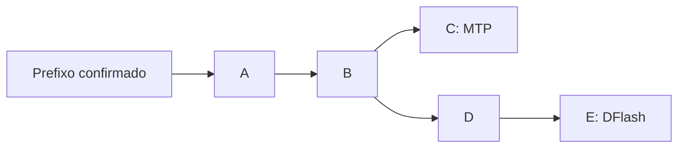

# Plano: MTP e DFlash2 concorrentes com reaproveitamento de sufixo

Data: 2026-09-29. Estado: proposta para decisão; modo híbrido ainda não implementado.

Base examinada na elaboração: branch `fix/dflash-xbox-pipeline`, commit `12231b55e`,
com as correções locais de split/prefetch pendentes naquele levantamento, depois
registradas em `47af27df0`. Este documento consolida a
discussão e propõe a primeira validação; não aprova automaticamente a implementação
das etapas seguintes nem muda a produção.

## 1. Recomendação para a primeira implementação

**Começar com MTP como referência e DFlash2 em observação paralela, ambos partindo
do mesmo prefixo confirmado.** O DFlash gera um bloco maior, mas seus tokens ainda
não são usados na resposta. Medimos se ele fica pronto no prazo, se o prefixo
coincide com a saída real e quanto do sufixo poderia ser aproveitado.

Essa etapa responde à incerteza principal: **há trabalho útil já pronto na Radeon
quando a próxima rodada precisaria gerar outro draft MTP?** Ela também mede o
custo das features, do seletor e da sincronização, mesmo quando nada é aproveitado.

Se os resultados justificarem, a segunda implementação passa a entregar o sufixo
pronto ao verificador normal do alvo. A verificação em árvore fica para uma etapa
posterior, pois exige mudanças maiores e ainda não sabemos se os dois drafts têm
diversidade útil suficiente.

Decisões propostas para o primeiro protótipo:

| Item | Proposta |
| --- | --- |
| Draft principal | MTP na 4070, sempre responsável pela trajetória no modo observação |
| Auxiliar | DFlash2 Q4_K_M na Radeon, com seletor junto ao head do alvo |
| Ponto de partida | Mesmo histórico confirmado e mesmo token âncora |
| Comprimentos | MTP com limites 2, 3 e 4; DFlash com até 7 propostas |
| Concorrência | Uma requisição, um slot, um trabalho auxiliar em voo |
| Amostragem inicial | Gulosa, `temperature=0` |
| Espera adicional pelo auxiliar | Zero na escolha do próximo draft |
| Prefetch local já existente | Desligado, para isolar o mecanismo novo |
| Primeiro resultado esperado | Relatório de viabilidade, sem alegar ganho híbrido antes de medi-lo |

## 2. O que já foi medido

Os [dados de referência preservados](benchmarks/mtp-dflash2-hybrid-baselines-20260929.json)
incluem resultados, comandos executados, prompts completos, configurações e hashes
dos binários disponíveis. Os logs integrais continuam nos diretórios temporários
indicados nesse arquivo. Resultados históricos devem ser repetidos antes de uma
decisão de implementação baseada em desempenho.

Ambiente: GOKAYA, Ryzen Z1 Extreme com Radeon integrada, RTX 4070 em eGPU;
alvo `Qwen3.8-27B-GSQ-RCO-IQ3_XXS-mtp.gguf`; draft
`Qwen3.8-27B-DFlash2-Q4_K_M.gguf`; contexto 16384; batch/ubatch 64; um slot;
KV `q4_0`; 192 tokens gerados. O prompt longo tinha 13850 tokens de entrada.

| Configuração medida | Repetição, tok/s | Código, tok/s | Longo, tok/s |
| --- | ---: | ---: | ---: |
| MTP, limite 4 e p_min 0,70, 2026-09-28 | 87,85 | 60,94 | 57,98 |
| DFlash local, limite 6, CPU econômica, APU 20 W, Radeon 2700 MHz | 71,43 | 48,26 | 49,71 |
| DFlash local, limite 6, CPU performance, APU 25 W, Radeon 2700 MHz | 72,99 | 47,91 | 51,83 |
| DFlash local, limite 6, CPU performance, APU 30 W, Radeon 2700 MHz | 72,09 | 48,30 | 51,64 |

- O MTP da tabela teve uma execução por prompt; os últimos DFlash usam mediana de
  três execuções curtas e duas longas. Não constituem um A/B contemporâneo.
- MTP e DFlash produziram os mesmos hashes nos prompts curtos da comparação
  original, mas hashes diferentes no longo. As otimizações posteriores do DFlash
  preservaram sua própria saída. Não há prova histórica de equivalência exata
  entre todas as trajetórias MTP e DFlash no prompt longo.
- Aumentar somente o TDP de 20 para 25/30 W manteve a Radeon perto de 800 MHz e
  praticamente não alterou a velocidade. Solicitar SCLK de 2700 MHz trouxe ganho
  de aproximadamente 7–9% já em 20 W nos testes correspondentes.
- O clock efetivo da CPU, medido por APERF/MPERF, subiu de aproximadamente 1,44 GHz
  em economia para 2,82–3,17 GHz em performance, sem ganho consistente de geração.
- A colocação do seletor junto ao head CUDA reduziu sua mediana de 5,691 para
  2,076 ms no A/B de colocação. A etapa de draft local ainda levou dezenas de ms
  por bloco; essa etapa inclui preparação, execução e obtenção dos hidden rows.
- O prefetch local corrigido teve 16 tentativas e zero reaproveitamentos no
  conjunto da revisão. Ele prevê outro ponto/âncora; esse resultado **não mede** a
  proposta de dois drafts partindo do mesmo prefixo descrita aqui.
- Os ensaios acima usaram DFlash com limite 6. O bloco com 7 propostas precisa
  ser medido: mudar o tamanho do bloco de difusão pode mudar as próprias previsões.

O fato de DFlash sozinho ser mais lento que MTP não decide o resultado híbrido.
O ganho depende do trabalho útil sobreposto e do custo adicional imposto ao alvo.

## 3. Alternativas discutidas

| Alternativa | Funcionamento | Potencial e custo | Prioridade proposta |
| --- | --- | --- | --- |
| Concordância | MTP e DFlash propõem o mesmo `ABC` | Pode informar confiança; não aumenta o número de tokens verificáveis. Concordância não dispensa o alvo. | Medir no observador |
| Alternativas verificadas juntas | MTP propõe `ABC`, DFlash propõe `ABDE`; verificar uma árvore | Compartilha prefixos e pode aproveitar erros diferentes. Exige isolamento dos ramos, estados e regra de aceitação adequada; mais posições aumentam o custo de verificação. | Posterior |
| Fallback após rejeição | Rodar DFlash somente depois de o alvo rejeitar o MTP | O alvo já determinou o token naquele ponto. DFlash ajuda na continuação, mas introduz outra etapa de draft sequencial. | Baixa |
| Escolha por rodada | Escolher MTP ou DFlash conforme custo/confiança medidos | Pode selecionar o melhor por carga. Precisa manter estados coerentes e pagar os custos de sincronização do mecanismo mantido pronto. | Possível evolução |
| Continuação a partir de contexto futuro | DFlash começa já condicionado ao final previsto do MTP | Features reais desse contexto ainda não existem; exige aproximação, previsão de âncora ou reorganização das dependências. | Adiar |
| Bloco longo do mesmo prefixo | Ambos começam do contexto atual; usar depois o sufixo compatível do DFlash | Dispensa features futuras para iniciar o draft. Depende de coincidência do prefixo, prazo e comprimento restante. | Candidato principal |

Exemplo de árvore para a segunda alternativa:



O alvo segue um caminho validado. Concatenar duas alternativas independentes numa
sequência causal comum não equivale a verificar seus dois ramos. Uma árvore exige
que cada nó veja seus antecedentes corretos, incluindo o tratamento dos estados
de camadas recorrentes/híbridas quando aplicável ao modelo.

## 4. Mecanismo escolhido para avaliação

### 4.1 Mesmo prefixo, bloco maior, sufixo pronto

```text
MTP propõe:             A B C
DFlash2 propõe:         A B C D E F G
Alvo confirma MTP:     A B C
Alvo escolhe bônus:          D
Sufixo candidato seguinte:    E F G
```

Na próxima chamada de draft, `EFG` pode substituir uma nova execução do MTP.
O alvo continua verificando esses tokens pelo caminho normal. O auxiliar não
confirma tokens por conta própria.

Esta variante usa as features reais do prefixo anterior, disponíveis antes de
MTP e DFlash começarem. Ela não precisa esperar pelas features futuras de `ABC`
para tentar prever o bloco maior.

### 4.2 Regra de correspondência e posições

Definir `p` como a posição do token âncora conhecido entregue aos dois drafts.
As propostas começam em `p+1`. Se o alvo aceitar `a` tokens MTP e escolher um
bônus, a sequência realmente emitida nessa verificação tem `c = a + 1` tokens.

Para um draft DFlash `D` de comprimento `d`, a primeira versão exige:

1. Mesmo request/slot, geração de contexto, âncora e histórico de origem.
2. Todos os `c` tokens realmente confirmados, **incluindo o bônus**, iguais a
   `D[0:c]` nas respectivas posições.
3. `c < d`, para existir um sufixo `D[c:d]`.
4. Resultado completo pronto no instante em que se escolhe o próximo draft.
5. Sufixo dentro dos limites de contexto, saída, batch e rollback do verificador.

Se o MTP for parcialmente rejeitado, ainda pode haver aproveitamento: comparar
com os tokens realmente confirmados, incluindo a correção escolhida pelo alvo,
e não com toda a proposta MTP original.

Coincidência apenas do último token ou do número de posições não basta. Usar
identidade de requisição e versão do contexto evita reutilizar um bloco de outro
prompt que por acaso termina com o mesmo token.

### 4.3 Limite de alcance

O DFlash2 disponível tem bloco treinado de oito posições, incluindo a âncora:
até sete propostas. Com `d = 7`, antes de qualquer limite adicional do servidor:

| Tokens MTP aceitos `a` | Consumidos incluindo bônus `c` | Sufixo restante `7-c` |
| ---: | ---: | ---: |
| 0 | 1 | 6 |
| 1 | 2 | 5 |
| 2 | 3 | 4 |
| 3 | 4 | 3 |
| 4 | 5 | 2 |

MTP mais curto deixa mais sufixo, mas pode reduzir a eficiência do próprio MTP e
encurtar a janela de sobreposição. MTP mais longo avança mais sozinho, porém exige
coincidência com um prefixo maior e deixa menos tokens. Comparar limites 2, 3 e 4
com seus próprios baselines e também com o melhor MTP isolado.

Uma taxa média de aceitação do DFlash isolado não fornece a probabilidade de
coincidência completa desses prefixos. O exemplo discutido de `0,9^5 ≈ 59%`
pressupõe 90% de acerto em cada etapa condicionada aos acertos anteriores; é uma
ilustração matemática, não uma estimativa medida deste modelo.

## 5. Restrições do código atual

Pontos de partida no código, usando símbolos porque os números de linha mudam:

| Arquivo / símbolo | Situação e trabalho necessário |
| --- | --- |
| [common/speculative.cpp](../common/speculative.cpp), `common_speculative_init_result::impl` | Há um model/context de draft principal. Criar ownership separado para o auxiliar sem transformar o contexto MTP em contexto DFlash. |
| Mesmo arquivo, `common_speculative_draft` | Usa implementações por prioridade e encerra a escolha quando encontra uma proposta. Não executa os dois drafts e combina resultados automaticamente. |
| Mesmo arquivo, `common_speculative_accept` | Recebe quantidade aceita, mas o observador também precisa dos IDs realmente confirmados, inclusive bônus, e de suas posições. |
| Mesmo arquivo, `common_speculative_get_state` | O suporte a mais de uma implementação com estado ainda tem limitações explícitas. Restauração exige tratamento do auxiliar. |
| Mesmo arquivo, `common_speculative_impl_draft_dflash` | Reaproveitar troca compacta de features/hidden rows e colocação do seletor do split local. |
| [tools/server/server-context.cpp](../tools/server/server-context.cpp) | Notificar o resultado real da verificação e o instante de escolha do próximo draft, preservando sampler, checkpoint e emissão existentes. |
| [src/llama-context.cpp](../src/llama-context.cpp) e [src/models/dflash.cpp](../src/models/dflash.cpp) | Extração de features e execução do transformer/seletor; medir cópias e sincronizações. |

A guarda atual que impede `local_split` junto com MTP não deve simplesmente ser
removida. O modo novo precisa inicializar os dois contextos corretamente e ter
parâmetros próprios para seus comprimentos e estados.

O plano deve usar as APIs existentes de batch, sampler, memória e checkpoint.
Conservar um único bloco auxiliar pendente não implica restaurar os antigos
CopySpec, DDTree, ring/tape ou verificadores privados removidos do fork.

## 6. Arquitetura mínima e invariantes

- **Propriedade de contextos:** alvo e MTP no fluxo principal; contexto DFlash
  usado por um único executor auxiliar. Nenhum thread acessa simultaneamente um
  contexto que outro está decodificando ou alterando.
- **Dados enviados ao worker:** cópias próprias das features/embeddings necessárias
  e metadados imutáveis. O worker não consulta buffers mutáveis do alvo durante
  sua verificação.
- **Um trabalho em voo:** se ocupado, atrasado ou sem contexto sincronizado,
  continuar com MTP. Não enfileirar previsões ilimitadas.
- **Pronto significa pronto:** incluir transformer, retorno dos hidden rows,
  projeção/seletor na 4070 e materialização dos tokens. Apenas terminar a Radeon
  não significa que já existe um draft utilizável.
- **Fallback sem espera:** a decisão usa consulta de prontidão. `future.get()`,
  destrutor bloqueante ou join de trabalho descartado não podem entrar no caminho
  normal do fallback. Finalização segura dos recursos continua obrigatória.
- **Memória limitada:** limitar filas de features e resultados. Se o auxiliar
  ficar para trás, suspender novas previsões e recuperar ou invalidar seu estado
  em separado; não bloquear MTP para preservar uma fila de especulação.
- **KV real:** estado especulativo do auxiliar não vira estado confirmado apenas
  porque seus tokens coincidiram. Remover a cauda especulativa e aplicar as
  features reais das posições aceitas antes de uma nova previsão dependente delas.
- **Bônus e estado são distintos:** o bônus já foi escolhido, mas suas features
  reais só chegam quando esse token é decodificado pelo alvo na rodada seguinte.
- **Depois de usar o auxiliar:** manter também o contexto MTP coerente com todos
  os tokens confirmados. Não encaminhar cegamente a mesma contagem de aceitação a
  dois drafts cujas posições internas podem ser diferentes.
- **Troca de prompt/EOS/cancelamento/restore:** invalidar o identificador do trabalho
  antigo; resultados atrasados não podem contaminar uma requisição nova. No MVP,
  um auxiliar que não possa ser reconstruído após restore fica indisponível até
  um ponto de inicialização válido; o caminho MTP deve continuar correto.
- **Custos compartilhados:** as cinco camadas de features do DFlash e seu seletor
  usam recursos/cópias associados ao alvo. A banda limitada da eGPU e a prioridade
  de execução na 4070 fazem parte da medição.

Na primeira versão ativa, truncar o sufixo ao limite de verificação já reservado
pelo servidor. A tabela de alcance mostra o máximo lógico, não permissão para
ultrapassar capacidade de outputs ou rollback. Ampliar essa reserva para aceitar
um sufixo maior será uma configuração separada, com sua memória e custo medidos.

## 7. Ordem de implementação e experimentos

### Etapa 0 — renovar a referência

Repetir MTP isolado no mesmo binário e ambiente do futuro protótipo, com limites
2, 3 e 4. Confirmar o DFlash de sete propostas isoladamente. Preservar comandos,
prompts, hashes do modelo/binário, logs de potência/clocks e memória utilizada.

Os resultados históricos servem para orientar o experimento, não para declarar
que um protótipo novo venceu uma referência de outro dia.

### Etapa 1 — observação paralela, recomendada primeiro

Entregas:

1. Contexto auxiliar independente e contrato de ownership definido, preservando
   o caminho MTP quando o modo experimental está desligado.
2. Iniciar DFlash do mesmo prefixo/âncora quando estiver sincronizado, permitindo
   sobreposição real com o draft MTP e a verificação do alvo.
3. Publicar blocos imutáveis identificados por request, versão do contexto,
   posição, âncora e timestamps de cada etapa.
4. Observar a sequência confirmada, incluindo bônus, e avaliar prontidão,
   coincidência e comprimento útil. Nenhum token auxiliar altera a resposta.
5. Registrar custo do auxiliar e motivos de descarte; comparar com MTP isolado.

Registrar também se a demora veio da Radeon, das cópias ou do seletor esperando
vez na 4070. Não somar tempos de execuções isoladas para alegar sobreposição.

Para estimar o valor do sufixo no observador, comparar seus tokens com a continuação
que o MTP/alvo emitir depois. Isso é uma medida de compatibilidade na trajetória
de referência, não aceitação real por uma nova rodada híbrida nem prova de ganho.
Tokens futuros observados só podem ser usados na análise posterior, nunca para
escolher um draft no instante da decisão.

### Etapa 2 — uso do sufixo pronto

Somente se a observação mostrar oportunidade concreta:

1. Aplicar as regras de correspondência e limites da seção 4.
2. Entregar o sufixo compatível ao verificador existente na próxima rodada.
3. Em resultado atrasado, prefixo incompatível ou sufixo insuficiente, usar MTP.
4. Usar cada bloco auxiliar no máximo uma vez no MVP; descartar sua sobra após
   essa tentativa para simplificar estado e validação.
5. Atualizar ambos os contextos com o caminho realmente confirmado.
6. Medir ganho completo por requisição, incluindo custos dos trabalhos descartados.

O objetivo da etapa é superar o melhor MTP isolado, além de superar o MTP com o
mesmo limite usado no híbrido. Vencer apenas um MTP artificialmente encurtado não
estabelece vantagem para o usuário.

### Etapa 3 — refinamentos orientados pelos dados

Conforme o motivo dominante de perda:

- Pronto tarde: investigar início do trabalho, duração do transformer, cópias e
  agendamento do seletor; só considerar espera limitada se o ganho líquido provar
  que ela compensa.
- Prefixo incompatível: medir complementaridade condicionada às rejeições do
  MTP; considerar árvore se alternativas úteis forem frequentes.
- Sufixo curto: ajustar limite MTP e avaliar ampliação segura da capacidade de
  verificação. Não aumentar o bloco DFlash além do tamanho treinado.
- Auxiliar custa mais do que economiza: reduzir sua frequência ou desligá-lo
  automaticamente para aquela carga, com decisão baseada em tempo por token.
- Trajetória gulosa aprovada: desenhar separadamente mistura de propostas e
  rejeição para temperatura maior que zero. Não tratar duas distribuições de
  draft como uma só nem supor preservação da distribuição sem essa regra.

## 8. Métricas que respondem à hipótese

| Métrica proposta | Definição / finalidade |
| --- | --- |
| Trabalhos iniciados e ciclos pulados | Denominadores explícitos; separar worker ocupado, estado atrasado e política de não lançar. |
| Prontidão na decisão | Fração dos trabalhos cujo resultado completo estava disponível no prazo real da próxima escolha. |
| Coincidência do prefixo | Comparação exata incluindo bônus; contar separadamente inclusive trabalhos concluídos tarde. |
| Reaproveitamento possível | Resultado pronto, prefixo correspondente e sufixo suficiente, tudo no mesmo ciclo. Não multiplicar taxas agregadas como se fossem independentes. |
| Comprimento útil | Histograma de `d-c` e do comprimento efetivamente fornecível após limites do verificador. |
| Complementaridade | Coincidência e sufixo útil condicionados ao número de tokens MTP aceitos, inclusive zero e aceitação parcial. |
| Compatibilidade futura em observação | Comprimento do sufixo que coincide com a continuação posterior do alvo; somente análise offline. |
| Aceitação real do auxiliar | Na etapa ativa, tokens aceitos/propostos e avanço por rodada, separados de origem MTP. |
| Custos de tempo | Captura, SYNC, transformer, retorno, seletor, espera, descarte, draft MTP evitado e verificação do alvo. |
| Resultado final | tok/s, tempo total, TTFT/prefill, latência entre tokens e caudas de latência. |
| Recursos | VRAM/RAM, bytes transferidos, clocks efetivos, PPT e temperatura. |

Critério econômico: aumentar o número de tokens confirmados por unidade de tempo
real. Uma alta taxa de coincidência sem sufixo útil ou com verificação mais lenta
pode produzir regressão. O fallback também tem custo indireto se o auxiliar já
consumiu banda, CPU ou tempo de GPU compartilhada.

## 9. Matriz de validação

Configuração inicial proposta: contexto 16384, batch/ubatch 64, um slot, KV
`q4_0`, mesmo GGUF alvo com MTP, DFlash2 Q4_K_M, APU 20 W, Radeon com SCLK solicitado
em 2700 MHz, CPU na política econômica observada e instrumentação APERF/MPERF.
Registrar também a política/potência/clocks da NVIDIA para impedir mudanças
silenciosas entre casos. Não impor carga artificial à Radeon no MTP isolado.

Comparar, para cada limite MTP 2/3/4:

| Caso | O que isola |
| --- | --- |
| MTP isolado | Referência real de latência, aceitação e tok/s |
| MTP + auxiliar inicializado, sem geração de blocos | Custo de manter extração/sincronização habilitadas e a memória adicional |
| MTP + observação DFlash paralela | Custo total e oportunidade de sufixo pronto |
| Híbrido ativo, quando aprovado | Ganho ou regressão efetivos |

Começar pelos três prompts preservados para continuidade, acrescentando código,
texto explicativo, respostas curtas e prompts menos repetitivos. A decisão final
não deve depender apenas de contagem de números. Incluir prompts curtos e o longo
de 13850 tokens; depois confirmar a conclusão em outros comprimentos.

Executar casos alternados após aquecimento. Para uma decisão de promoção, propor
ao menos cinco repetições pareadas por cenário e registrar dispersão; aumentar a
amostra se o efeito estiver na mesma ordem da variação observada. Interromper os
serviços concorrentes somente durante o benchmark e restaurar serviços, CPU,
SCLK e TDP em `finally`, confirmando estado e saúde reais.

## 10. Validação de correção e critérios de avanço

Antes de declarar o modo ativo pronto, cobrir:

- Prefixo igual, divergência na primeira/intermediária/última posição e bônus
  diferente; sufixo vazio, curto e maior que a capacidade de verificação.
- Zero aceitos, aceitação parcial e total do MTP; propostas DFlash que acertam
  justamente a correção de um token rejeitado pelo MTP.
- Worker atrasado, erro do worker, fila cheia e retorno após troca de requisição.
- EOS, limite de geração, cancelamento, novo prompt e repetição de prompt.
- Fronteiras de contexto, rollback/checkpoint e restauração de slot quando o
  modo declarar suporte a esses caminhos.
- Retomada do MTP depois de usar um bloco DFlash; features e KV sem posições
  duplicadas ou estados de tokens rejeitados.
- Igualdade da trajetória gulosa com referência contemporânea e determinística.
  Investigar a primeira divergência em vez de atribuí-la automaticamente ao
  ruído numérico; os hashes históricos diferentes do prompt longo são um alerta
  concreto para essa validação.

Critérios de decisão propostos, ainda negociáveis:

1. Observação: demonstrar ocorrências reais de resultado pronto, prefixo correto
   e sufixo útil, e estimar benefício que possa superar o custo adicional medido.
   Nenhuma porcentagem fixa de coincidência, isoladamente, aprova a etapa ativa.
2. Correção: nenhuma divergência inexplicada, contaminação de estado ou espera
   bloqueante no fallback; casos de sucesso e descarte efetivamente exercitados.
3. Desempenho: buscar pelo menos 5% de ganho de geração no conjunto acordado sobre
   o melhor MTP isolado, acima da dispersão. São metas propostas, não resultados.
4. Regressões: propor limite de 3% nos cenários representativos e de 5% em TTFT/
   caudas de latência. Aprovar eventual troca de desempenho por carga explicitamente.
5. Se houver zero ou poucos sufixos úteis, analisar comprimento, prazo e
   coincidência antes de ampliar a implementação. Registrar resultado negativo.

## 11. Decisões para nossa próxima conversa

| Decisão | Recomendação | Consequência |
| --- | --- | --- |
| Primeiro código | Observação paralela | Valida a hipótese de aceitação/prontidão antes de mudar a origem dos drafts entregues ao alvo. |
| Começar diretamente ativo? | Somente como alternativa deliberada | Requer desde o início sincronização de ambos os estados, roteamento de aceitação e toda a validação de fallback. |
| Árvore de propostas já? | Adiar | É uma mudança maior no verificador; usar primeiro as medidas de complementaridade. |
| Profundidade inicial | DFlash 7; MTP 2/3/4 | Encontra o equilíbrio entre avanço do MTP, prazo e sufixo restante. |
| Hardware inicial | APU 20 W, Radeon 2700 MHz, CPU econômica | Os testes anteriores não sustentam aumento permanente de TDP/CPU como principal fonte de ganho. |
| Temperatura maior que zero | Etapa posterior | Exige uma regra explícita para propostas, distribuições e rejeição. |

A escolha da primeira implementação permanece aberta. A recomendação é
**etapa 0 + etapa 1**, usando o reaproveitamento ativo de sufixo como próximo passo
condicionado às medidas, sem começar pela árvore de verificação.

## 12. Referências e limites de comparação

- [SpecInfer](https://arxiv.org/abs/2305.09781): múltiplos candidatos organizados
  em árvore e verificados em paralelo; fundamenta a alternativa de ramificações.
- [Cascade Speculative Drafting](https://arxiv.org/abs/2312.11462): combinações
  de etapas de drafting; não é prova de ganho para este par de modelos/hardware.
- [PipeInfer](https://arxiv.org/abs/2407.11798): sobreposição de especulação e
  verificação, com descarte de trabalhos invalidados; referência para concorrência.
- [Speculative decoding no fork](speculative.md): comportamento local e limites
  existentes, incluindo split local e prefetch que já foram implementados.

Os ganhos dos artigos não são previsões para a 4070 em eGPU e a Radeon desta
máquina. O híbrido proposto ainda não tem taxa de reaproveitamento nem velocidade
medidas.
